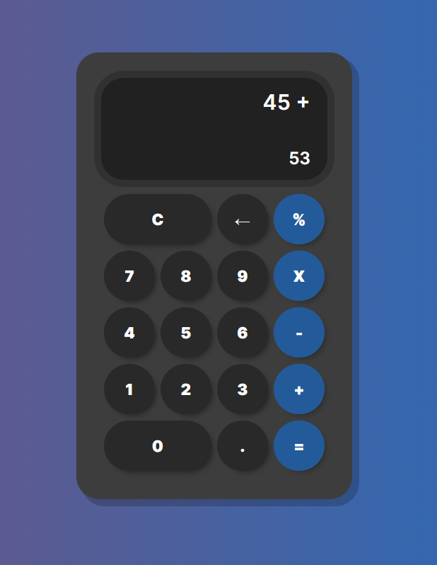

# CalculatorJS

**LINK WEBSITE**
- https://cportolan-calculatorjs.vercel.app/

Esta es una calculadora con funciones básicas (sumar, restar, dividir y multiplicar). Además, tiene para realizar operaciones con decimales y marca correctamente errores de cálculos.
Es un proyecto realizado como método de práctica de manejo del DOM con JavaScript

**Tecnologías que utilicé:**

- HTML5
- CSS3
- JavaScript
